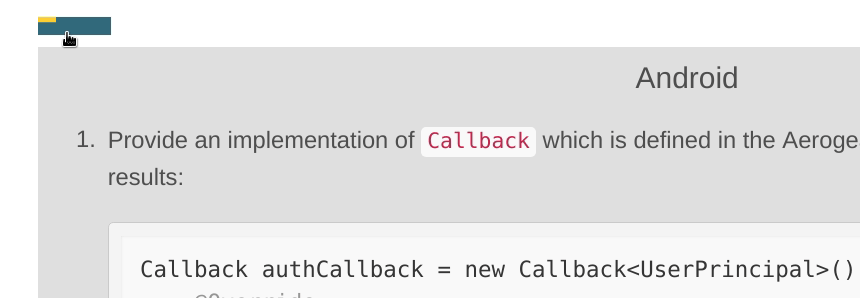

= Previewing changes to docs.aerogear.org

This procedure allows you to preview a static website with proposed changes to link:docs.aerogear.org[^] without installing Antora.

. Fork this repo.
. Edit the site.yml to point to your fork of link:https://github.com/aerogear/mobile-docs[mobile-docs^] and/or link:https://github.com/aerogear/mobile-security[mobile-security^] and specify the branch you want to preview, for example:

+
----
  - url: https://github.com/finp/mobile-docs.git
    branches: fix-things
----
+
and/or 
+
----
  - url: https://github.com/finp/mobile-security.git
    branches: fix-things
----
+
IMPORTANT: Edited `site.yml` must be in the `master` branch of `mobile-netlify`.

. Create a link:https://www.netlify.com[Netlify account^] if you don't already have one.
. Click *New site from Git* in Netlify if not done before. 
** To trigger a redeploy with the changes in already created Netlify project:
+ 
* _Select the site in Netlify->Deploys->Trigger Deploy._
+ 
* Skip to step 9.
. Select the fork of `mobile-netlify` you created in step one.
. Select to use the `master` branch.
. Click *Deploy*.
. First deploy can take up to 10 minutes. Subsequent deploys will take ~30 seconds.
. Netlify will deploy the rendered site on their servers with randomly generated URL, for example `https://dreamy-shannon-845356.netlify.com`

== Troubleshooting
.I am unable to build the docs. / The docs are not built correctly.
- Ensure that you don't touch any other settings in Netlify other than stated in the procedure above.
- Ensure that the docs are written with correct link:http://asciidoc.org/[AsciiDoc Syntax^].
- Try clearing the Netlify cache by selecting the checkbox _Clear Cache_ in _Trigger Deploy_ from step 4.
- If all else fails, consult the docs
** link:https://docs.antora.org[Antora Docs^]
** link:https://www.netlify.com/docs/[Netlify Docs^]
  
== Known issues

- There is an issue with the tabs, they render incorrectly. However you can still navigate to each tab as follows:

